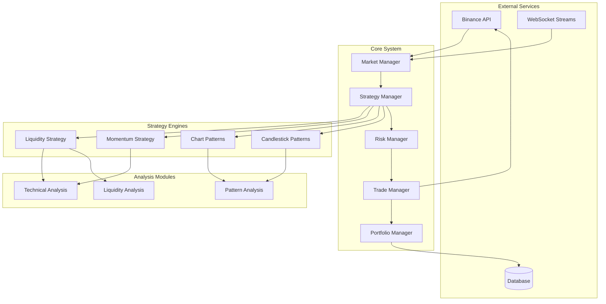

# Design Document

## Overview

The crypto trading bot will be built as a modular, event-driven system using Python with asyncio for concurrent operations. The architecture follows a microservices-inspired approach with clear separation of concerns between market data processing, strategy execution, risk management, and trade execution.

Key design principles:
- **Modularity**: Each trading strategy and component is independently testable and configurable
- **Fault Tolerance**: Robust error handling and recovery mechanisms throughout
- **Performance**: Asynchronous processing for real-time market data and trade execution
- **Extensibility**: Easy addition of new trading strategies and indicators
- **Security**: Secure API key management and encrypted configuration storage

## Architecture

### High-Level Architecture



### Component Interaction Flow

1. **Market Data Ingestion**: Market Manager receives real-time data from Binance WebSocket
2. **Strategy Processing**: Strategy Manager distributes data to active strategies
3. **Signal Generation**: Each strategy analyzes data and generates trading signals
4. **Risk Assessment**: Risk Manager evaluates signals against risk parameters
5. **Trade Execution**: Trade Manager executes approved trades via Binance API
6. **Portfolio Updates**: Portfolio Manager tracks positions and performance

## Components and Interfaces

### Market Manager
**Responsibility**: Real-time market data collection and distribution

**Key Methods**:
- `connect_websocket()`: Establish WebSocket connections for real-time data
- `get_orderbook(symbol)`: Fetch current order book data
- `get_klines(symbol, interval)`: Retrieve candlestick data
- `subscribe_ticker(symbol)`: Subscribe to price ticker updates

**Data Structures**:
```python
@dataclass
class MarketData:
    symbol: str
    timestamp: datetime
    price: float
    volume: float
    bid: float
    ask: float
    orderbook: OrderBook
```

### Strategy Manager
**Responsibility**: Coordinate multiple trading strategies and signal aggregation

**Key Methods**:
- `register_strategy(strategy)`: Add new trading strategy
- `process_market_data(data)`: Distribute data to all strategies
- `aggregate_signals()`: Combine signals from multiple strategies
- `get_strategy_performance()`: Track individual strategy performance

**Signal Priority System**:
- Confidence-based weighting (0.0 - 1.0)
- Strategy performance history weighting
- Market condition adaptability scoring

### Risk Manager
**Responsibility**: Position sizing, stop-loss management, and portfolio protection

**Key Methods**:
- `validate_trade(signal)`: Check trade against risk parameters
- `calculate_position_size(signal)`: Determine optimal position size
- `monitor_drawdown()`: Track portfolio drawdown limits
- `emergency_stop()`: Halt trading on extreme conditions

**Risk Parameters**:
```python
@dataclass
class RiskConfig:
    max_position_size: float = 0.02  # 2% of portfolio per trade
    daily_loss_limit: float = 0.05   # 5% daily loss limit
    max_drawdown: float = 0.15       # 15% maximum drawdown
    stop_loss_pct: float = 0.02      # 2% stop loss
    take_profit_pct: float = 0.04    # 4% take profit
```

### Trade Manager
**Responsibility**: Order execution and position management

**Key Methods**:
- `execute_market_order(order)`: Execute market orders
- `execute_limit_order(order)`: Execute limit orders
- `set_stop_loss(position)`: Set stop-loss orders
- `close_position(position)`: Close existing positions
- `get_account_balance()`: Retrieve account information

### Strategy Engines

#### Liquidity Strategy
**Analysis Focus**: Order book depth and liquidity patterns

**Key Indicators**:
- Bid-ask spread analysis
- Order book imbalance detection
- Volume-weighted average price (VWAP)
- Market depth analysis

**Signal Generation**:
```python
def generate_signal(self, market_data: MarketData) -> TradingSignal:
    liquidity_score = self.calculate_liquidity_score(market_data.orderbook)
    if liquidity_score > self.high_liquidity_threshold:
        return TradingSignal(
            action="BUY" if self.detect_buying_pressure() else "SELL",
            confidence=liquidity_score,
            strategy="liquidity"
        )
```

#### Momentum Strategy
**Analysis Focus**: Price momentum across multiple timeframes

**Key Indicators**:
- Relative Strength Index (RSI)
- Moving Average Convergence Divergence (MACD)
- Rate of Change (ROC)
- Average Directional Index (ADX)

**Multi-timeframe Analysis**:
- 1-minute for entry timing
- 5-minute for trend confirmation
- 15-minute for overall direction

#### Chart Pattern Strategy
**Analysis Focus**: Technical chart formations

**Supported Patterns**:
- Triangle patterns (ascending, descending, symmetrical)
- Head and shoulders (regular and inverse)
- Flag and pennant patterns
- Wedge patterns (rising and falling)
- Double top/bottom patterns

**Pattern Recognition Pipeline**:
1. Price data preprocessing and smoothing
2. Peak and trough identification
3. Pattern template matching
4. Breakout confirmation
5. Target and stop-loss calculation

#### Candlestick Pattern Strategy
**Analysis Focus**: Japanese candlestick formations

**Supported Patterns**:
- Single candlestick: Doji, Hammer, Shooting Star
- Two-candlestick: Engulfing, Harami, Piercing Line
- Three-candlestick: Morning/Evening Star, Three White Soldiers

**Fallback Activation**:
- Triggered when liquidity analysis confidence < 0.6
- Uses pattern strength scoring (0.0 - 1.0)
- Combines with volume confirmation

## Data Models

### Core Trading Models

```python
@dataclass
class TradingSignal:
    symbol: str
    action: str  # BUY, SELL, HOLD
    confidence: float  # 0.0 - 1.0
    strategy: str
    timestamp: datetime
    target_price: Optional[float] = None
    stop_loss: Optional[float] = None
    position_size: Optional[float] = None

@dataclass
class Position:
    symbol: str
    side: str  # LONG, SHORT
    size: float
    entry_price: float
    current_price: float
    unrealized_pnl: float
    stop_loss: Optional[float] = None
    take_profit: Optional[float] = None
    timestamp: datetime

@dataclass
class Trade:
    id: str
    symbol: str
    side: str
    size: float
    price: float
    commission: float
    timestamp: datetime
    strategy: str
    pnl: Optional[float] = None
```

### Configuration Models

```python
@dataclass
class BotConfig:
    api_key: str
    api_secret: str
    testnet: bool = True
    symbols: List[str] = field(default_factory=lambda: ["BTCUSDT", "ETHUSDT"])
    strategies: Dict[str, bool] = field(default_factory=dict)
    risk_config: RiskConfig = field(default_factory=RiskConfig)
    notification_config: NotificationConfig = field(default_factory=NotificationConfig)
```

## Error Handling

### API Error Management
- **Rate Limiting**: Exponential backoff with jitter
- **Connection Failures**: Automatic reconnection with circuit breaker pattern
- **Invalid Orders**: Order validation before submission
- **Account Errors**: Balance and permission checks

### Strategy Error Handling
- **Data Anomalies**: Outlier detection and filtering
- **Calculation Errors**: Graceful degradation to simpler indicators
- **Signal Conflicts**: Weighted voting system with confidence scores

### System Recovery
- **Database Failures**: Local caching with periodic sync
- **Memory Issues**: Automatic data cleanup and garbage collection
- **Process Crashes**: Automatic restart with state recovery

## Testing Strategy

### Unit Testing
- Individual strategy logic testing with mock market data
- Risk management parameter validation
- Technical indicator calculation accuracy
- Pattern recognition algorithm testing

### Integration Testing
- End-to-end signal generation and execution flow
- API integration with Binance testnet
- Database operations and data persistence
- WebSocket connection stability

### Backtesting Framework
- Historical data replay system
- Strategy performance evaluation
- Risk metric calculation
- Parameter optimization testing

### Performance Testing
- Latency measurement for signal generation
- Memory usage monitoring under load
- Concurrent strategy execution testing
- Market data processing throughput

## Security Considerations

### API Security
- Encrypted storage of API credentials
- IP whitelisting for API access
- Read-only API keys where possible
- Regular credential rotation

### System Security
- Input validation for all external data
- Secure configuration file handling
- Audit logging for all trades and decisions
- Access control for bot management interface

### Operational Security
- Monitoring for unusual trading patterns
- Automated alerts for system anomalies
- Backup and recovery procedures
- Incident response protocols